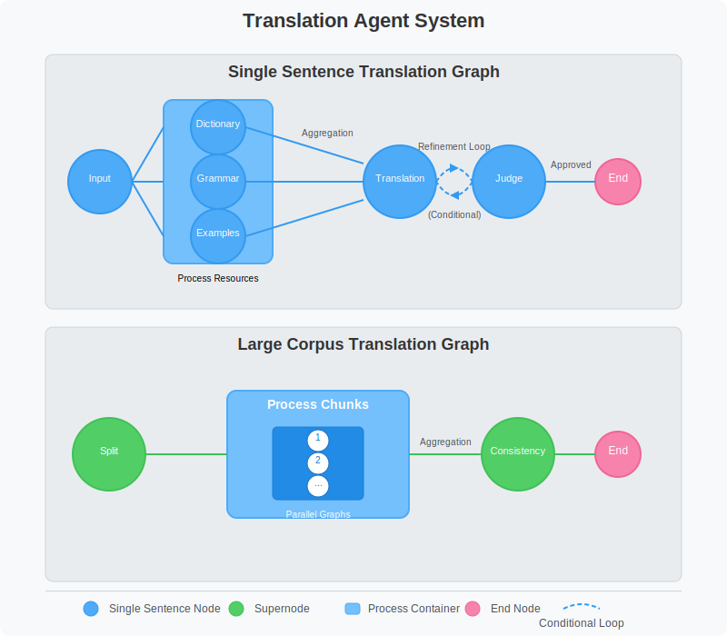

# Translation Agent System

An AI-powered translation system that utilizes a multi-agent approach to produce high-quality translations between different languages. The system leverages LangGraph for orchestrating the translation workflow and Streamlit for the user interface.


## 🌟 Features
- **Multi-Agent Architecture**: Separate agents for processing dictionary, grammar, examples, translation, and validation
- **Context-Aware Translation**: Support for providing custom dictionaries, grammar rules, and translation examples, and process them in parallel
- **Quality Assurance**: Optional LLM as a judge to evaluate and refine translations
- **Large Text Support**: LLM based chunking for processing large corpus texts in parallel and efficiently 
- **Consistency Checking**: Ensures terminology and style consistency across document chunks
- **Flexible Model Selection**: Support for different backbone models for agents

## 📁 Project Structure

- `app.py`: Main Streamlit application with user interface
- `graph.py`: LangGraph workflow definitions and agent implementations
- `prompts.py`: Prompt templates for different agents in the system
- `requirements.txt`: Required Python dependencies
- `drawgraph.py (TODO)`: Utility to visualize the LangGraph workflow
- `data/`: Sample dictionary, grammar, and translation examples

## 🔧 Prerequisites

- Python 3.12+
- Endpoint API key and  URL

## 📦 Installation

1. Clone the repository:
   ```bash
   git clone https://github.com/mmheydari97/translation-agent-system.git
   cd translation-agent-system
   ```

2. Create and activate a virtual environment (recommended):
   ```bash
   uv venv .ling_venv --python=python3.12
   
   # On Windows
   venv\Scripts\activate
   
   # On macOS/Linux
   source venv/bin/activate
   ```

3. Install the required dependencies:
   ```bash
   uv pip install -r requirements.txt
   ```

## ⚙️ Configuration

### API Keys and Endpoints

Create a `secrets.toml` file in the `.streamlit` directory with your Azure OpenAI API credentials:

```toml
[openrouter]
ENDPOINT_URL = "https://your-endpoint.com/"
API_KEY = "your-api-key"

[ollama]
ENDPOINT_URL = "http://localhost:11434/v1"
API_KEY = "your-api-key"
```

## 🚀 Usage

1. Start the Streamlit application:
   ```bash
   streamlit run app.py
   ```

2. Open your browser and navigate to the URL shown in the terminal (usually http://localhost:8501)

3. Configure the translation settings:
   - Select your translation model (Gpt-4o-mini or Phi-3-small-8k-instruct)
   - Enter the source and target languages
   - Input the text to translate
   - Optionally upload reference files (dictionary, grammar rules, examples)
   - Choose between "Single Sentence" or "Large Corpus" processing mode
   - Toggle the use of the LLM judge for quality evaluation

4. Click the "Generate Translation" button and wait for the results

## 🛠️ Detailed Component Descriptions

### `app.py`

The main Streamlit application that provides the user interface for the translation system. Key components:

- **API Configuration**: Sidebar for selecting translation models and entering API credentials
- **Translation Form**: Input fields for source/target languages and text to translate
- **Context Options**: File uploaders for dictionary, grammar rules, and examples
- **Processing Mode**: Option to process as single sentence or large corpus
- **Results Display**: Shows translation prompts, initial translations, judge feedback, and final translations

### `graph.py`

Defines the LangGraph workflows and agent implementations:

- **State Schema**: `TranslationState` TypedDict for the graph state
- **Agent Nodes**:
  - `process_dictionary`: Extracts relevant word pairs from the dictionary
  - `process_grammar`: Processes grammar rules for translation
  - `process_examples`: Extracts relevant translation examples
  - `perform_translation`: Performs the main translation task
  - `judge_translation`: Evaluates the translation quality
  - `retry_translation`: Refines the translation based on judge feedback
  - `split_corpus`: Splits large texts into manageable chunks
  - `process_chunks`: Processes chunks in parallel
  - `check_consistency`: Ensures consistency across translated chunks

- **Workflow Graphs**:
  - `build_translation_graph()`: For single sentence translation
  - `build_supernode_graph()`: For large corpus translation

### `prompts.py`

Contains all prompt templates used by the various agents:

- `get_system_prompt()`: System prompt for the translation agents
- `get_translation_prompt()`: Main translation prompt template
- `get_dictionary_prompt()`: Prompt for dictionary processing
- `get_grammar_prompt()`: Prompt for grammar rule processing
- `get_examples_prompt()`: Prompt for example translation processing
- `get_judge_prompt()`: Prompt for translation quality evaluation
- `get_retry_prompt()`: Prompt for translation refinement
- `get_chunking_prompt()`: Prompt for text chunking
- `get_consistency_prompt()`: Prompt for consistency checking

### `drawgraph.py`

A utility script to visualize the LangGraph workflow using ASCII art, helpful for understanding the agent interaction flow.

### Data Files

The `data/` directory contains sample files that can be used as references:

- `dictionary.txt`: Sample dictionary with word pairs
- `grammar.txt`: Sample grammar rules
- `samples.txt`: Sample translation examples

## 🔄 Translation Workflow

### Single Sentence Mode:

1. **Resource Processing**: Dictionary, grammar, and examples are processed in parallel
2. **Initial Translation**: The main translation is performed using the processed resources
3. **Quality Evaluation**: The judge agent evaluates the translation quality
4. **Refinement (if needed)**: If the judge finds issues, the translation is refined
5. **Final Result**: The system returns the final translation

### Large Corpus Mode:

1. **Text Chunking**: The large text is split into manageable chunks
2. **Parallel Processing**: Each chunk is processed through the single sentence workflow
3. **Consistency Checking**: The system checks for consistency across translated chunks
4. **Final Assembly**: The final translation is assembled from the chunks with consistency ensured

## 🧪 Advanced Usage

### Creating Custom Reference Files

- **Dictionary**: Create a text file with word pairs in the format `source_word : target_word`
- **Grammar Rules**: Create a text file with grammar rules for the target language in mermaid (.md) format
- **Examples**: Create a text file with example translations in the format 
```json
   source: sentence
   target: translation
 ```

### Using Different Models

The system supports any model deployed to your Azure OpenAI resource. To use a different model:

1. Update the `secrets.toml` file with credentials for your model
2. Add your model to the model selection dropdown in `app.py`

## 🔍 Troubleshooting

- **API Errors**: Ensure your API keys and endpoints are correct (verify with Postman)
- **Memory Issues**: For very large texts, consider adjusting the chunk size in `prompts.py` and max token in `graph.py`
- **Timeout Errors**: Large texts or complex translations may take longer to process

## 📋 Requirements

The full list of dependencies from `requirements.txt`:

- streamlit: For the web interface
- langgraph: For orchestrating the agent workflow
- pydantic: For data validation and settings management
- litellm: For LLM API abstraction
- python-dotenv: For environment variable management
- instructor: For structured outputs from LLMs
